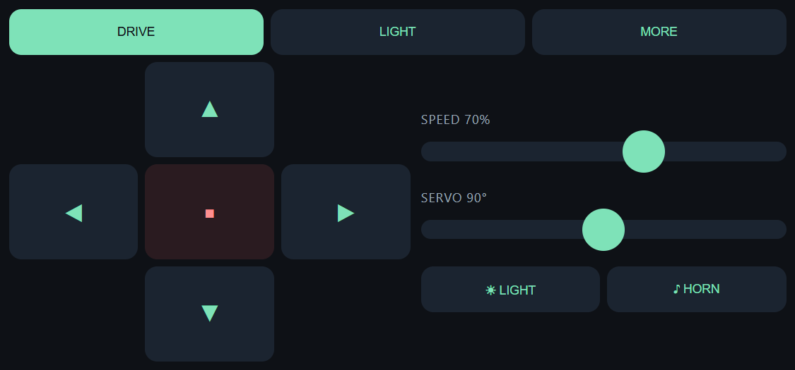
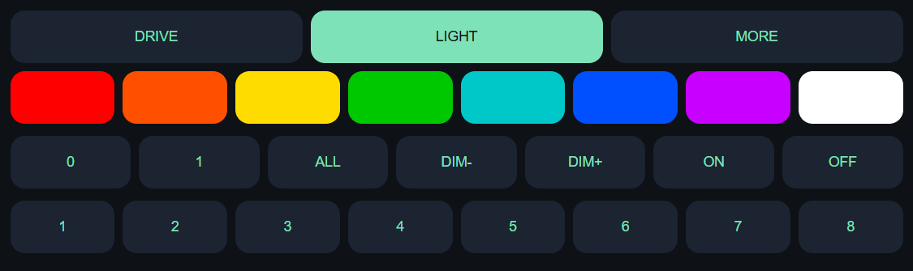
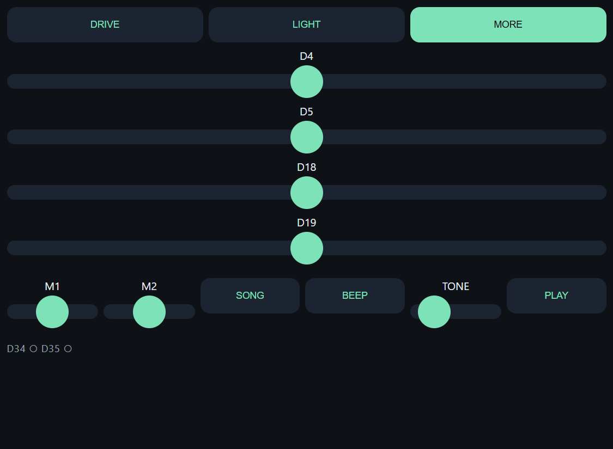
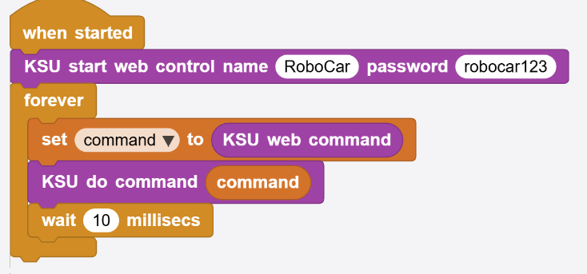

# ใบความรู้ — ควบคุมรถหุ่นยนต์ผ่านหน้าเว็บ

**ระดับชั้น** มัธยมศึกษาปีที่ 3 · **เวลา** 3 คาบ (คาบละ 50 นาที) · **อุปกรณ์** Cytron ROBO ESP32 + MicroBlocks

---

## เป้าหมายของบทเรียน

เมื่อจบ 3 คาบนี้ นักเรียนจะสามารถ

1. **ขับรถหุ่นยนต์ได้จริง** จากหน้าเว็บบนมือถือของตัวเอง
2. **อธิบายเส้นทางของคำสั่ง** ตั้งแต่นิ้วที่กดปุ่มไปจนถึงล้อที่หมุน
3. **ต่อบล็อกโปรแกรม** ให้รถตอบสนองคำสั่งครบทุกปุ่ม
4. **แก้ไขหน้า HTML** เพื่อเพิ่มปุ่มใหม่ของตัวเอง แล้วทำให้รถทำตาม

---

## ภาพรวม — รถคันนี้ทำงานอย่างไร

รถคันนี้ **ไม่ได้ต่ออินเทอร์เน็ต** และ **ไม่ต้องใช้แอป** บอร์ด ESP32 ทำสองหน้าที่พร้อมกัน

| หน้าที่ | ทำอะไร |
|---|---|
| เป็นเราเตอร์ WiFi | สร้างสัญญาณ WiFi ชื่อ `RoboCar` ขึ้นมาเอง (เรียกว่า **ฮอตสปอต**) |
| เป็นเว็บเซิร์ฟเวอร์ | เก็บหน้าเว็บควบคุมไว้ในตัว แล้วส่งให้เบราว์เซอร์เมื่อมีคนขอ |

เมื่อมือถือเข้า WiFi ชื่อ `RoboCar` แล้วเปิด `192.168.4.1` มือถือกำลัง **คุยกับรถโดยตรง** ไม่ผ่านใครเลย

### เส้นทางของคำสั่ง (ต้องจำให้ได้)

```
นิ้วกดปุ่ม ▲ บนหน้าเว็บ
   ↓
เบราว์เซอร์ส่งข้อความสั้น ๆ ว่า  /Forward
   ↓
ส่งผ่านคลื่น WiFi ไปถึงบอร์ด ESP32
   ↓
บล็อก [KSU web command] อ่านได้คำว่า  Forward
   ↓
บล็อก if เปรียบเทียบคำ แล้วเจอว่าตรงกัน
   ↓
บล็อก [KSU forward] จ่ายไฟให้มอเตอร์
   ↓
ล้อหมุน รถวิ่งไปข้างหน้า
```

**แนวคิดสำคัญ:** ปุ่มบนหน้าเว็บ **ไม่ได้สั่งมอเตอร์โดยตรง** ปุ่มแค่ "ส่งคำ" ไปให้บอร์ด แล้วโปรแกรมในบอร์ดเป็นคนตัดสินใจว่าคำนั้นหมายถึงอะไร ถ้าโปรแกรมไม่รู้จักคำนั้น กดปุ่มก็ไม่มีอะไรเกิดขึ้น

---

# คาบที่ 1 — ขับรถให้ได้ก่อน

**เป้าหมายคาบนี้:** ทุกกลุ่มขับรถได้จริงจากมือถือ และเข้าใจว่า "URL ก็คือคำสั่ง"

## 1.1 ส่วนประกอบของรถ

| ส่วนประกอบ | ตำแหน่งบนบอร์ด | ทำอะไร |
|---|---|---|
| มอเตอร์ล้อซ้าย/ขวา | ช่องขันสาย **M1** และ **M2** | ขับเคลื่อน |
| เซอร์โว (แขนกล) | หัวเข็ม **D4** | หมุนได้ 0–180 องศา |
| ไฟ RGB 2 ดวง | มีบนบอร์ดแล้ว (ขา GPIO 15) | ไฟหน้า / ไฟสี |
| ลำโพงเล็ก (บัซเซอร์) | มีบนบอร์ดแล้ว (ขา GPIO 23) | แตร เสียงเพลง |
| ปุ่มกด 2 ปุ่ม | **D34** และ **D35** | รับอินพุตจากคน |
| แบตเตอรี่ | ช่องขันสายสีเขียว | จ่ายไฟให้มอเตอร์ |

> ไฟ RGB และบัซเซอร์ **ติดมาบนบอร์ดแล้ว** ไม่ต้องต่อสายเพิ่ม สิ่งที่ต้องต่อมีแค่มอเตอร์ 2 ตัว แบตเตอรี่ และเซอร์โว (ถ้ามี)

## 1.2 ขั้นตอนเปิดใช้งาน

1. เสียบสาย USB จากคอมพิวเตอร์เข้าบอร์ด และ**เปิดสวิตช์แบตเตอรี่**
2. เปิดโปรแกรม MicroBlocks แล้วเปิดไฟล์ **`RoboCar.ubp`**
3. เลือกบอร์ด (ไอคอนรูปปลั๊ก) → เลือกพอร์ตของ ESP32
4. กดปุ่ม **Start** (สามเหลี่ยมเขียว)
5. รอสัญญาณว่าพร้อม: **ไฟ RGB เรืองแสงเขียวจาง ๆ** และแขนเซอร์โวหมุนไปกลางที่ 90 องศา
6. ที่มือถือ: เข้า WiFi ชื่อ **`RoboCar`** รหัสผ่าน **`robocar123`**
7. Android จะเตือนว่า "เครือข่ายนี้ไม่มีอินเทอร์เน็ต" → เลือก **เชื่อมต่อต่อไป** และปิดตัวเลือก *สลับไปใช้เน็ตมือถืออัตโนมัติ*
8. เปิดเบราว์เซอร์ พิมพ์ **`192.168.4.1`** (ไม่ต้องมี `https`)
9. **ถือมือถือแนวนอน** — ถ้าถือแนวตั้งหน้าเว็บจะขึ้นข้อความให้หมุนเครื่อง

## 1.3 หน้าจอควบคุม

หน้าเว็บมี 3 แท็บ กดสลับได้ที่แถบด้านบน



| แท็บ | มีอะไร |
|---|---|
| **DRIVE** | แป้นทิศทาง (กดค้างเพื่อวิ่ง ปล่อยแล้วหยุด), แถบเลื่อนความเร็ว, แถบเลื่อนเซอร์โว, ปุ่มไฟ, ปุ่มแตร — บนคอมพิวเตอร์ใช้ปุ่มลูกศรหรือ W A S D ได้ |
| **LIGHT** | ช่องสี 8 สี, เลือกเป้าหมาย (ไฟดวง 0 / ดวง 1 / ทั้งคู่), ปุ่มหรี่ไฟ DIM +/−, สวิตช์ LED 8 ดวง |
| **MORE** | แถบเลื่อนเซอร์โว 4 ตัว, แถบเลื่อนมอเตอร์ 2 ตัว, ปุ่ม SONG / BEEP / PLAY เสียง, และตัวอ่านสถานะปุ่ม D34 D35 แบบสด |





แท็บ LIGHT และ MORE ส่งคำสั่งอีกสิบเอ็ดคำที่ไม่ได้อยู่ในสิบคำของคาบที่ 2 — ทั้งหมดใช้งานได้ด้วยบล็อกเดียวคือ `KSU do command` ตามที่อธิบายในข้อ 2.5

## 1.4 การค้นพบสำคัญของคาบนี้ — URL ก็คือคำสั่ง

ลองพิมพ์ในช่องที่อยู่เว็บโดยตรง แล้วดูว่ารถทำอะไร

```
192.168.4.1/Forward
192.168.4.1/Stop
192.168.4.1/Horn
192.168.4.1/Speed_50
```

รถขยับ**ทั้งที่ไม่ได้กดปุ่มเลย** สรุปได้ว่า

> **ปุ่มบนหน้าเว็บเป็นเพียงทางลัด** ของการพิมพ์ URL เหล่านี้ หน้าเว็บสวย ๆ ทั้งหน้าไม่ได้ทำอะไรมากกว่าการส่งคำสั้น ๆ ไปให้บอร์ด

## 1.5 กติกาการตั้งชื่อคำสั่ง

| กติกา | ถูก | ผิด |
|---|---|---|
| ตัวแรกพิมพ์ใหญ่ ตัวที่เหลือพิมพ์เล็ก | `Forward` | `forward`, `FORWARD` |
| ตัวเลขต่อท้ายด้วยขีดล่าง `_` | `Speed_70` | `Speed70`, `Speed-70` |

**ตัวพิมพ์เล็กพิมพ์ใหญ่มีความหมาย** คอมพิวเตอร์ถือว่า `Forward` กับ `forward` เป็นคำที่ต่างกันคนละคำ

---

# คาบที่ 2 — ทำให้รถเข้าใจคำสั่ง

**เป้าหมายคาบนี้:** ต่อบล็อกเองจนทุกปุ่มบนแท็บ DRIVE ใช้งานได้ครบ 10 คำสั่ง

## 2.1 หัวใจของโปรแกรม — ลูปที่ถามซ้ำ ๆ

โปรแกรมทั้งหมดอยู่ในลูป `forever` เพียงลูปเดียว บอร์ดทำงานนี้ซ้ำ ๆ ประมาณ 100 ครั้งต่อวินาที

```
when started
  KSU start web control name (RoboCar) password (robocar123)
  forever
    set [command] to (KSU web command)      ← มีใครกดปุ่มมาไหม
    ...ตรวจว่าคำที่ได้คือคำอะไร...
    wait 10 millisecs
```

| บล็อก | หน้าที่ |
|---|---|
| `KSU start web control name _ password _` | เปิดฮอตสปอตและเว็บเซิร์ฟเวอร์ ทำครั้งเดียวตอนเริ่ม |
| `KSU web command` | ถามว่า "มีคำสั่งเข้ามาไหม" ถ้ามีจะรายงานคำนั้น ถ้าไม่มีจะรายงานค่าว่าง |
| `wait 10 millisecs` | พักสั้น ๆ ให้บอร์ดได้หายใจ |

**ตัวแปร `command`** คือกล่องเก็บคำที่เพิ่งเข้ามา เราเก็บไว้ในตัวแปรก่อนเพราะต้องนำไปเปรียบเทียบหลายครั้ง

> **ข้อควรรู้:** ลูปนี้ต้องวิ่งเร็วอยู่เสมอ ถ้าเราใส่ `wait 3000 millisecs` ไว้กลางลูป บอร์ดจะไม่ได้ฟังคำสั่งอยู่ 3 วินาที กดปุ่มก็ไม่ตอบสนอง

## 2.2 บล็อก if — "ถ้าได้คำนี้ ให้ทำสิ่งนี้"

```
if ((command) = 'Forward')
    KSU forward
```

อ่านเป็นภาษาคนว่า *"ถ้าคำที่เข้ามาคือ Forward ให้จ่ายไฟเดินหน้า"* — เพิ่มคำสั่งใหม่ก็คือเพิ่ม `if` อีกอันหนึ่ง

## 2.3 คำสั่ง 10 คำของแท็บ DRIVE

| คำสั่งที่ส่งมา | บล็อกที่ต้องใช้ | ผลที่เกิด |
|---|---|---|
| `Forward` | `KSU forward` | เดินหน้า |
| `Backward` | `KSU backward` | ถอยหลัง |
| `Left` | `KSU turn left` | เลี้ยวซ้าย |
| `Right` | `KSU turn right` | เลี้ยวขวา |
| `Stop` | `KSU stop` | หยุด |
| `Light1` | `KSU light [on]` | เปิดไฟหน้า |
| `Light0` | `KSU light [off]` | ปิดไฟหน้า |
| `Horn` | `KSU horn` | บีบแตร |
| `Speed` | `KSU set speed (KSU command value) %` | ตั้งความเร็ว |
| `Servo` | `KSU set arm angle (KSU command value) degrees` | หมุนแขนกล |

**สังเกต:** `Light1` และ `Light0` เป็น **คำเต็มคนละคำ** ไม่ใช่คำ `Light` ที่พาตัวเลขมา — จงใจทำแบบนี้เพื่อให้เห็นแนวคิด "คำต่างกัน ทำงานต่างกัน" ก่อนจะเรียนเรื่องการส่งค่าตัวเลข

## 2.4 คำสั่งที่พาตัวเลขมาด้วย

ปุ่มธรรมดาส่งแค่คำ แต่**แถบเลื่อน**ต้องส่งตัวเลขมาด้วย วิธีส่งคือใช้ขีดล่างคั่น

| สิ่งที่ส่งมา | คำสั่ง | ตัวเลขที่พามา |
|---|---|---|
| `/Speed_70` | `Speed` | 70 |
| `/Servo_120` | `Servo` | 120 |
| `/Rgb_2_255_120_0` | `Rgb` | 2, 255, 120, 0 |

กติกาคือ **แยกข้อความที่ขีดล่าง ตัวแรกคือคำสั่ง ตัวถัดไปทั้งหมดคือตัวเลข**

อ่านตัวเลขด้วยบล็อกเหล่านี้

| บล็อก | รายงานอะไร |
|---|---|
| `KSU command value` | ตัวเลขตัวแรก |
| `KSU command value # 2` | ตัวเลขตัวที่ 2 (ใช้กับ `Rgb` `Motor` `Tone` ที่มีหลายตัว) |

> ต้องอ่านค่าใน**รอบเดียวกัน**กับที่รับคำสั่งมา เพราะรอบต่อไปค่าจะถูกเขียนทับ
> ถ้าคำสั่งที่เข้ามาไม่ได้พาตัวเลขมาเลย `KSU command value` จะรายงานค่า 90

## 2.5 ทางลัด — บล็อก `KSU do command`

เขียน `if` ทีละคำสำหรับคำสั่งทั้ง 21 คำที่หน้าเว็บส่งได้ จะใช้เวลาเป็นชั่วโมง จึงมีบล็อกเดียวที่รู้จักทุกคำอยู่แล้ว



โปรแกรมสั้นแค่นี้ทำให้**ทุกปุ่มในทั้งสามแท็บใช้งานได้ทันที** รวมทั้งสี RGB, LED 8 ดวง, เซอร์โว 4 ตัว, มอเตอร์แบบดิบ และเสียงทั้งหมด

**แล้วทำไมต้องเรียนเขียน `if` เองในข้อ 2.3?** เพราะ `KSU do command` ข้างในก็คือ `if` ชุดเดียวกันกับที่นักเรียนต่อเอง ไม่ใช่เวทมนตร์ — เมื่อเข้าใจกลไกแล้ว จึงใช้ทางลัดได้อย่างรู้เรื่อง และเมื่อต้องเพิ่มคำสั่งใหม่ที่บล็อกนี้ไม่รู้จัก (คาบที่ 3) นักเรียนจะรู้ว่าต้องไปเติมที่ไหน

---

# คาบที่ 3 — แก้หน้า HTML เพิ่มปุ่มของตัวเอง

**เป้าหมายคาบนี้:** เพิ่มปุ่มใหม่ลงหน้าเว็บ และทำให้รถตอบสนองปุ่มนั้น

## 3.1 หน้าเว็บถูกเก็บไว้ที่ไหน

หน้าเว็บ **ไม่ได้อยู่บนอินเทอร์เน็ตและไม่ได้อยู่ในมือถือ** แต่ถูกเก็บเป็น **ข้อความ** อยู่ในหน่วยความจำของบอร์ด

ปัญหาคือ MicroBlocks บังคับว่า **หนึ่งสคริปต์แปลได้ไม่เกิน 1000 ไบต์** แต่หน้าเว็บทั้งหน้ายาว **5,092 ตัวอักษร** จึงต้องหั่นเก็บเป็น 8 ก้อน

| บล็อก | ความยาว | เนื้อหาหลัก |
|---|---|---|
| `_KSU_ROBOESP32_p1` | 692 | โครงหน้าและ CSS ตอนต้น |
| `_KSU_ROBOESP32_p2` | 700 | CSS ต่อ |
| `_KSU_ROBOESP32_p3` | 700 | แป้นทิศทาง แถบเลื่อน SPEED / SERVO |
| `_KSU_ROBOESP32_p4` | 686 | **ปุ่ม LIGHT / HORN** และฟังก์ชันส่งคำสั่ง `s()` |
| `_KSU_ROBOESP32_p5` | 696 | **ตัวจับการกดปุ่ม** และคีย์ WASD |
| `_KSU_ROBOESP32_p6` | 700 | แท็บ LIGHT — ช่องสีและ LED |
| `_KSU_ROBOESP32_p7` | 697 | แท็บ MORE — เซอร์โวและมอเตอร์ |
| `_KSU_ROBOESP32_p8` | 221 | เสียง และตัวอ่านสถานะปุ่ม |

บล็อก `_ksu send control page` เอาทั้ง 8 ก้อนมาต่อกันด้วยบล็อก `join` แล้วส่งออกไปเป็นหน้าเว็บหนึ่งหน้า

**ไฟล์ `RoboCar-Control.html`** คือหน้าเว็บเดียวกันนี้ แต่เก็บเป็นไฟล์เดียวอ่านง่าย ใช้สำหรับเปิดดูหน้าตาและแก้ไขบนคอมพิวเตอร์ — **ไฟล์นี้ไม่ใช่ไฟล์ที่บอร์ดส่งออกไป** แก้แล้วต้องคัดลอกเข้าไปในบล็อกด้วยมือ

## 3.2 กติกาเหล็ก 4 ข้อของหน้าเว็บนี้

| กติกา | เพราะอะไร |
|---|---|
| **ห้ามมีเครื่องหมาย `'` (อะพอสทรอฟี) เด็ดขาด** | ข้อความใน MicroBlocks ใช้ `'` เป็นตัวคร่อมข้อความ ถ้ามีอยู่ข้างในจะทำให้ข้อความขาดกลาง และไม่มีวิธีหลบหลีก |
| **ใช้ได้เฉพาะตัวอักษรอังกฤษ/ตัวเลข (ASCII)** | อักษรไทยหรือสัญลักษณ์พิเศษกินหลายไบต์ ถ้ารอยตัดก้อนไปตกกลางตัวอักษร หน้าเว็บจะเสีย — ต้องใช้รหัสแทน เช่น `&deg;` แทน ° หรือ `&#9650;` แทน ▲ |
| **ห้ามใช้คอมเมนต์ `//` ในจาวาสคริปต์** | ตอนต่อ 8 ก้อนกลับเข้าด้วยกัน **การขึ้นบรรทัดใหม่หายไปหมด** ทุกอย่างจะกลายเป็นบรรทัดเดียว โค้ดหลัง `//` จะถูกมองว่าเป็นคอมเมนต์ทั้งหมด |
| **แต่ละก้อนไม่ควรเกิน 700 ตัวอักษร** | เหลือที่ว่างเผื่อไว้ ไม่ให้ชนเพดาน 1000 ไบต์ |

ตรวจขนาดสคริปต์ได้โดย **คลิกขวาที่สคริปต์ → show compiled bytes**

## 3.3 ปุ่มทุกปุ่มต้องผ่านฟังก์ชัน `s()`

ในหน้าเว็บมีกลไกกันคำสั่งท่วม: **ยอมให้มีคำสั่งวิ่งอยู่บนอากาศได้ครั้งละหนึ่งคำสั่งเท่านั้น** ถ้าผู้ใช้ขยับแถบเลื่อนรัว ๆ คำสั่งใหม่จะไป**เขียนทับ**คำสั่งที่ยังไม่ได้ส่ง ทำให้รถทำตามค่าล่าสุดเสมอ ไม่ใช่ทำตามคิวเก่าที่ค้างอยู่

```javascript
function s(p){q=p;g()}
```

> **กติกา:** ปุ่มใหม่ทุกปุ่มต้องเรียก `s("ชื่อคำสั่ง")` ห้ามเรียก `fetch` เอง — ถ้าเรียกเองจะข้ามกลไกนี้ และทำให้การขับรถกระตุกหรือค้าง

## 3.4 ภารกิจ — เพิ่มปุ่ม SPIN ที่หมุนรถ 1 วินาที

การเพิ่มคำสั่งใหม่ต้องแก้ **3 ที่** ให้ครบ ขาดที่ใดที่หนึ่งปุ่มจะกดได้แต่ไม่มีอะไรเกิดขึ้น

### ที่ 1 — เพิ่มปุ่มลงในหน้าเว็บ (บล็อก `_KSU_ROBOESP32_p4`)

หาข้อความนี้ แล้วเติมปุ่มใหม่ต่อท้ายปุ่ม HORN

```html
<button id=H>&#9834; HORN</button>
```

กลายเป็น

```html
<button id=H>&#9834; HORN</button><button id=N>SPIN</button>
```

### ที่ 2 — บอกหน้าเว็บว่าปุ่มนี้ส่งคำว่าอะไร (บล็อก `_KSU_ROBOESP32_p5`)

หาข้อความนี้

```javascript
E("H").onpointerdown=function(v){v.preventDefault();s("Horn")};
```

แล้วเติมบรรทัดนี้ต่อท้ายทันที (ห้ามเว้นบรรทัด)

```javascript
E("N").onpointerdown=function(v){v.preventDefault();s("Spin")};
```

### ที่ 3 — สอนบอร์ดให้รู้จักคำว่า `Spin`

เพิ่ม `if` ลงในลูป `forever`

```
if ((command) = 'Spin')
    KSU turn left
    wait 1000 millisecs
    KSU stop
```

จากนั้นกด **Start** ใหม่ แล้ว **โหลดหน้าเว็บซ้ำ**บนมือถือ (สำคัญมาก ถ้าไม่โหลดใหม่ มือถือจะยังใช้หน้าเว็บหน้าเดิมที่ไม่มีปุ่ม)

### ข้อสังเกตที่ต้องอธิบายให้ได้

`wait 1000 millisecs` อยู่**ในลูปหลัก** ระหว่างที่รถหมุน 1 วินาทีนั้น บอร์ด**ไม่ฟังคำสั่งอะไรเลย** กดปุ่มหยุดก็ไม่ทัน — นี่คือราคาที่ต้องจ่ายของการใส่การหน่วงเวลาไว้ในลูปที่ต้องคอยฟัง

## 3.5 ขั้นตอนการทำงานที่แนะนำ

1. เปิด `RoboCar-Control.html` ด้วยโปรแกรมแก้ไขข้อความ แก้ตรงนั้นก่อน
2. เปิดไฟล์เดียวกันด้วยเบราว์เซอร์บนคอมพิวเตอร์เพื่อดูหน้าตา — ปุ่มจะขึ้นให้เห็น แต่**กดแล้วจะไม่มีอะไรเกิดขึ้น** เพราะไม่มีบอร์ดคอยตอบ (ปกติ ไม่ใช่ความผิดพลาด)
3. เมื่อพอใจแล้ว คัดลอกข้อความ 2 ชิ้นเข้าไปในบล็อก `_p4` และ `_p5` ใน MicroBlocks
4. คลิกขวา → show compiled bytes เพื่อตรวจว่ายังไม่เกิน 1000 ไบต์
5. Start → โหลดหน้าเว็บใหม่ → ทดสอบ

---

## ภาคผนวก ก — คำสั่งทั้งหมดที่หน้าเว็บส่งได้

| เส้นทางที่ส่ง | คำสั่ง | ตัวเลข | ผล |
|---|---|---|---|
| `/Forward` `/Backward` `/Left` `/Right` `/Stop` | ตามคำ | — | ขับเคลื่อน |
| `/Light1` `/Light0` | ตามคำ | — | เปิด/ปิดไฟหน้าสีขาว |
| `/Horn` | `Horn` | — | แตรสองจังหวะ |
| `/Speed_70` | `Speed` | 70 | ความเร็วมอเตอร์ % |
| `/Servo_120` | `Servo` | 120 | เซอร์โว D4 (0–180) |
| `/ServoB_120` `/ServoC_120` `/ServoD_120` | `ServoB` `ServoC` `ServoD` | มุม | เซอร์โว D5 / D18 / D19 |
| `/Rgb_2_255_120_0` | `Rgb` | ดวง, แดง, เขียว, น้ำเงิน | ดวง: 0, 1, หรือ 2 = ทั้งคู่ |
| `/Dim_25` `/Dim_-25` | `Dim` | % ที่เปลี่ยน | เพิ่ม/ลดความสว่าง RGB |
| `/Led_3_1` | `Led` | ลำดับ 1–8, 0/1 | LED GPIO หนึ่งดวง |
| `/Leds_1` `/Leds_0` | `Leds` | 0/1 | LED GPIO ทั้ง 8 ดวง |
| `/Motor_1_80` `/Motor_2_-80` | `Motor` | ตัวที่ 1/2, กำลัง −100 ถึง 100 | คุมมอเตอร์ตรง ๆ |
| `/Tone_440_300` | `Tone` | ความถี่ Hz, เวลา ms | เสียงบัซเซอร์ |
| `/Song` | `Song` | — | เพลง Happy Birthday |
| `/Beep` | `Beep` | — | เสียงสั้นหนึ่งครั้ง |
| `/Status` | — | — | บอร์ดตอบเอง ไม่ถึงโปรแกรมนักเรียน |

`/Status` ใช้ภายในสำหรับตัวอ่านสถานะปุ่มบนแท็บ MORE บอร์ดตอบเป็นข้อความ `b1,b2,speed,arm` เช่น `1,0,70,90` — เขียน `if` ดักคำนี้ไม่ได้ เพราะบล็อก `KSU web command` จัดการจบไปก่อนแล้ว

## ภาคผนวก ข — บล็อกในไลบรารี KSU

```
-- เว็บ --
KSU start web control name [RoboCar] password [robocar123]
KSU web command                                    (รายงานค่า)
KSU command value                                  (รายงานค่า)
KSU command value # [1]                            (รายงานค่า)
KSU do command [ ]
KSU IP address                                     (รายงานค่า)

-- ขับเคลื่อน --
KSU forward · KSU backward · KSU turn left · KSU turn right · KSU stop
KSU set speed [70] %
KSU drive [forward] for [500] ms
KSU steer [0] (-100 ซ้าย ถึง 100 ขวา)
KSU set motor [M1] power [70] (-100 ถึง 100)
KSU set motor trim M1 [-1] M2 [-1]

-- เซอร์โว --
KSU set arm angle [90] degrees (0 ถึง 180)
KSU set servo [D4] to [90] degrees (0 ถึง 180)

-- ไฟ --
KSU light [on]
KSU set RGB [all] color [ ]
KSU set RGB [all] red [255] green [240] blue [200]
KSU change RGB brightness by [25] %
KSU LED [D16] [on]
KSU LED number [1] (1 ถึง 8) [on]

-- เสียง --
KSU horn · KSU beep
KSU play tone [440] Hz for [300] ms
KSU play note [C] octave [0] for [400] ms
KSU play Happy Birthday

-- อินพุต --
KSU button [D34] is pressed                        (รายงานค่า)
KSU read analog pin [ ]                            (รายงานค่า)
```

## ภาคผนวก ค — แก้ปัญหาที่พบบ่อย

| อาการ | สาเหตุและวิธีแก้ |
|---|---|
| กดเดินหน้าแต่รถถอยหลัง **และ** เลี้ยวซ้ายกลายเป็นขวา | มอเตอร์กลับขั้วทั้งสองตัว ไลบรารีตั้งค่า trim เป็น `-1 -1` มาแล้วสำหรับกรณีนี้ |
| กดเดินหน้าแล้วรถหมุนอยู่กับที่ | มอเตอร์กลับขั้วตัวเดียว ลองคลิกบล็อก `KSU set motor trim M1 [1] M2 [-1]` ถ้าไม่หายลอง `M1 [-1] M2 [1]` |
| หน้า–หลังถูก แต่ซ้าย–ขวาสลับ | เสียบมอเตอร์ผิดช่อง สลับปลั๊ก M1 กับ M2 |
| มือถือเปิดหน้าเว็บไม่ได้ | ตรวจว่ามือถืออยู่บน WiFi `RoboCar` ไม่ใช่เน็ตมือถือ และที่อยู่คือ `192.168.4.1` ไม่มี `https` |
| บอร์ดรีเซ็ตตัวเองตอนเซอร์โวขยับ | เซอร์โวกินไฟมาก เปลี่ยนแบตใหม่ หรือแยกแหล่งจ่ายไฟให้เซอร์โว |
| เซอร์โวที่ D5 / D18 / D19 ไม่ขยับ | ไม่ได้เสียบเซอร์โวไว้ที่หัวนั้น บล็อกยังรายงานว่าสำเร็จเสมอ เพราะบอร์ดตรวจไม่ได้ว่ามีเซอร์โวต่ออยู่จริงหรือไม่ |
| หน้าเว็บหน่วงตอนเปิดแท็บ MORE | แท็บ MORE ถาม `/Status` ทุก 0.5 วินาที แย่งช่องทางเดียวกับคำสั่งขับ กลับไปแท็บ DRIVE เมื่อไม่ใช้ |
| ขึ้นข้อความ `Script too large; over 1000 bytes!` | บล็อกเก็บข้อความมากเกินไป ต้องหั่นเป็นสองบล็อกแล้วต่อกันด้วย `join` |
| เพิ่มปุ่มแล้วแต่ปุ่มไม่ขึ้นบนมือถือ | ยังไม่ได้โหลดหน้าเว็บใหม่ หรือยังไม่ได้กด Start ใหม่หลังแก้บล็อก |
| ปุ่มขึ้นแล้ว กดได้ แต่รถเฉย | บอร์ดยังไม่รู้จักคำสั่งนั้น ตรวจว่าเพิ่ม `if` ในลูปแล้ว และคำสะกดตรงกันทุกตัวอักษร |

---

## หมายเหตุสำหรับครู

- **ไฟล์ที่ใช้:** `RoboCar.ubp` เป็นไฟล์เฉลย (ลูปใช้ `KSU do command` ทำงานครบทุกปุ่ม) และมีสคริปต์ `if` แบบยาวทั้ง 10 คำสั่งวางแยกไว้ไม่ต่อกับลูป เพื่อใช้อธิบายให้ห้องเห็นว่าบล็อกทางลัดไม่ใช่เวทมนตร์
- **ก่อนแจกงานคาบที่ 2** ให้ Save As เป็นไฟล์สำหรับนักเรียน แล้วลบสคริปต์ `if` แบบยาวออก และดึง `KSU do command` ออกจากลูป — ไม่อย่างนั้นนักเรียนจะเห็นเฉลยทันที
- ถ้าต้องการไฟล์ตั้งต้นที่มี **กล่องเครื่องมือ (toolbox)** ให้นักเรียนลากบล็อกมาต่อ เคยทำไว้ในชื่อ `robocar-STUDENT.ubp` — ไฟล์นั้นต่อ `Forward` ไว้ให้เป็นตัวอย่างหนึ่งคำสั่ง และวางอีก 9 คำสั่งเป็นชิ้นแยกรออยู่ทางขวา ดึงกลับมาจากประวัติ git ได้ด้วยคำสั่ง `git show 40df6c7:robocar-STUDENT.ubp > RoboCar-STUDENT.ubp`
- **การเปลี่ยนชื่อ WiFi ประจำกลุ่ม** แก้ข้อความสองช่องในบล็อก `KSU start web control` รหัสผ่านต้องยาวอย่างน้อย 8 ตัวอักษร
- ถ้ามีรถหลายคันในห้องเดียวกัน **ต้องตั้งชื่อฮอตสปอตไม่ให้ซ้ำกัน** ไม่อย่างนั้นมือถือจะเข้าผิดคัน
- อ่านรายละเอียดฮาร์ดแวร์ ผังขา และไลบรารีเพิ่มเติมได้ที่ `README.md`
